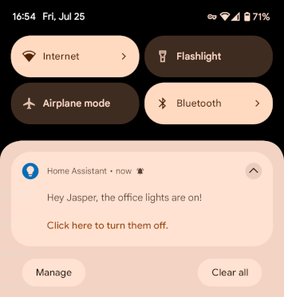

# CodeCasa.NetDaemon.Utils

[](https://github.com/DevJasperNL/NetDaemon.Utils?tab=MIT-1-ov-file)
[](https://github.com/DevJasperNL/NetDaemon.Utils/releases/latest)
[](https://github.com/DevJasperNL/NetDaemon.Utils/actions/workflows/ci-build-and-test.yml)

A collection of .NET libraries focused on NetDaemon extensions and utilities.

## Available Libraries

Package | Description
--- |---
[CodeCasa.NetDaemon.Notifications.Phone](#codecasanetdaemonnotificationsphone) | This library provides the `PhoneNotificationEntity` class, making it easy to create, update, and manage phone notifications in Home Assistant.
[CodeCasa.NetDaemon.Notifications.InputSelect](#codecasanetdaemonnotificationsinputselect) | This library helps you turn a Home Assistant Dropdown/InputSelect helper entity into a dynamic notifications list.
[CodeCasa.NetDaemon.RuntimeState](#codecasanetdaemonruntimestate) | This library provides the `NetDaemonRuntimeStateService`, which allows you to check and subscribe to the runtime state of `NetDaemon`.
[CodeCasa.NetDaemon.Extensions.Observables](#codecasanetdaemonextensionsobservables) | Collection of extension methods meant to enhance NetDaemon entities with boolean observables allowing for a more intuitive coding experience.

## CodeCasa.NetDaemon.Notifications.Phone

This library provides the `PhoneNotificationEntity` class, making it easy to create, update, and manage phone notifications in Home Assistant.

**Features include:**

- Easy notification creation and updating
- Support for actionable notifications with customizable buttons.

### Usage

Define an entity for a specific phone:
```cs
public class JasperPhoneNotifications(NotifyServices notificationServices, IHaContext haContext)
    : PhoneNotificationEntity(haContext, notificationServices.MobileAppPixel7);
```

Register the entity as a service:
```cs
serviceCollection..AddTransient<JasperPhoneNotifications>();
```

Use it to send notifications (with optional actions):
```cs
[NetDaemonApp]
internal class Example
{
    public Example(
        LightEntities lightEntities,
        JasperPhoneNotifications jasperPhoneNotifications)
    {
        var notificationId = $"{nameof(Example)}_Notification"; // Note: Using an ID that is consistent between runs also ensures that old notifications are removed/replaced on phones when the app is reloaded.
        lightEntities.OfficeLights.SubscribeOnOff(
            () =>
            {
                jasperPhoneNotifications.Notify(new AndroidNotificationConfig
                {
                    Message = "Hey Jasper, the office lights are on!",
                    StatusBarIcon = "mdi:lightbulb",
                    Actions =
                    [
                        new(() => lightEntities.OfficeLights.TurnOff(), "Click here to turn them off.")
                    ]
                }, notificationId);
            },
            () => jasperPhoneNotifications.RemoveNotification(notificationId));
    }
}
```

This automation sends a notification to Jasper’s phone whenever the office lights are turned on. The notification includes a button that allows him to turn off the lights directly from the notification:



> Other example implementations: https://github.com/DevJasperNL/CodeCasa

## CodeCasa.NetDaemon.Notifications.InputSelect

This library helps you turn a Home Assistant Dropdown/InputSelect helper entity into a dynamic notifications list.

> Example implementations (including visualisation in Blazor): https://github.com/DevJasperNL/CodeCasa

## CodeCasa.NetDaemon.RuntimeState

This library provides the `NetDaemonRuntimeStateService`, which allows you to check and subscribe to the runtime state of `NetDaemon`.

While this service isn’t necessary when using `NetDaemonApp` classes for automations, it can be useful in contexts where you access NetDaemon entities outside of that scope — for example, in a (Blazor) UI or background service. In such cases, `NetDaemonRuntimeStateService` helps determine whether the NetDaemon runtime is initialized and connected.

### Runtime States
The service exposes three possible states:
- **Initializing** – NetDaemon is still initializing and building its state cache. Entity access is not yet available.
- **Connected** – NetDaemon is connected to Home Assistant.
- **Disconnected** – NetDaemon is disconnected from Home Assistant. Cached entity states remain available, but no updates will be received until reconnected.

### Usage

Register the service:
```cs
builder.Services.AddNetDaemonRuntimeStateService();
```

Then use it, for example, in a Blazor component:

```cs
@inject NetDaemonRuntimeStateService NetDaemonRuntimeStateService

@code {
    private bool _netDaemonInitialized;
    private bool _netDaemonConnected;

    protected override void OnInitialized()
    {
        NetDaemonRuntimeStateService.ConnectedChangesWithCurrent().Subscribe(state =>
        {
            _netDaemonInitialized = state != NetDaemonStates.Initializing;
            _netDaemonConnected = state == NetDaemonStates.Connected;
            InvokeAsync(StateHasChanged);
        });
    }
}
```

or in a `BackgroundService`:
```cs
internal class ExampleService : BackgroundService
{
    private readonly NetDaemonRuntimeStateService _netDaemonRuntimeStateService;

    public ExampleService(NetDaemonRuntimeStateService netDaemonRuntimeStateService)
    {
        _netDaemonRuntimeStateService = netDaemonRuntimeStateService;
    }

    protected override async Task ExecuteAsync(CancellationToken cancellationToken)
    {
        // Wait for the NetDaemon runtime to be initialized.
        await _netDaemonRuntimeStateService.WaitForInitializationAsync(cancellationToken);
        if (cancellationToken.IsCancellationRequested)
        {
            return;
        }

        // Implement code that works with NetDaemon entities here.
    }
}
```

> Example Blazor/BackgroundServices implementations: https://github.com/DevJasperNL/CodeCasa

## CodeCasa.NetDaemon.Extensions.Observables

Collection of extension methods meant to enhance NetDaemon entities with boolean observables allowing for a more intuitive coding experience.

- For more information on NetDaemon, click [here](https://netdaemon.xyz/).
- Article containing more examples and explanation about this library: [Article with examples](https://dev.to/devjaspernl/supercharging-home-assistant-automations-initial-states-and-boolean-logic-for-netdaemon-rx-3bd5).

### Example Usage

```cs
public Example(
    SunEntities sunEntities, 
    CoverEntities coverEntities)
{
    const int curtainCloseSunElevation = 1;
    sunEntities.Sun
            .ToBooleanObservable(e => e.Attributes?.Elevation <= curtainCloseSunElevation);
    
    sunIsDown.SubscribeTrueFalse(
        () =>
        {
            coverEntities.LivingRoomFrontWindowCurtain.CloseCover();
            coverEntities.LivingRoomBackWindowCurtain.CloseCover();
        },
        () =>
        {
            coverEntities.LivingRoomFrontWindowCurtain.OpenCover();
            coverEntities.LivingRoomBackWindowCurtain.OpenCover();
        });
}
```

**Breakdown:**

```cs
sunEntities.Sun.ToBooleanObservable(e => e.Attributes?.Elevation <= curtainCloseSunElevation);
```
Create a stateful `IObservable<bool>` from the sun entity `Sun` which emits `true` when `Elevation` is smaller than `curtainCloseSunElevation`, `false` otherwise. Stateful in this context means that the observable will immediately emit the current value returned from the predicate when an observer is subscribed. (internally, the NetDaemon extension methods `StateChangesWithCurrent` and `StateAllChangesWithCurrent` are used for this.)

```cs
sunIsDown.SubscribeTrueFalse(
        () =>
        {
            coverEntities.LivingRoomFrontWindowCurtain.CloseCover();
            coverEntities.LivingRoomBackWindowCurtain.CloseCover();
        },
        () =>
        {
            coverEntities.LivingRoomFrontWindowCurtain.OpenCover();
            coverEntities.LivingRoomBackWindowCurtain.OpenCover();
        });
```

`SubscribeTrueFalse` is an extension method on `IObservable<bool>` that assigns an action for when `true` is emitted as well as when `false` is emitted.

This implementation will immediately open or close the covers depending on the initial result of the predicate as well as update whenever the result of the predicate changes.

### Boolean Observables

This library contains a set of extension methods to convert entities to implementations of `IObservable<bool>`. If no predicate is provided, the `On` state is mapped to true, the `Off` state is mapped to `false`.

The usage of `ToBooleanObservable` (or one of the aliases `ToOnOffObservable` or `ToOpenClosedObservable`) on an entity will use `StateChanges` (or `StateAllChanges` when a predicate is provided) to result in a stateful `IObservable<bool>`.

In case a stateful observable is not desired, the method `ToChangesOnlyBooleanObservable` can be used.

The use of stateful `IObservable<bool>` implementations enables the use of logic operators and scheduling extensions provided by the `Reactive.Boolean` library. This allows for improved readability of implementations.

For a more detailed documentation on extension methods for `IObservable<bool>`, check out the documentation for `Reactive.Boolean` [here](https://github.com/DevJasperNL/Reactive.Boolean).

**Example**

The following example shows the usage of boolean (`Not`, `Or` and `And`) and scheduling (`LimitTrueDuration`) logic to write a complex automation that is still easy to understand and will trigger on startup.
```cs
var noOneAsleep = inputBooleanEntities.JasperAsleep.ToBooleanObservable()
    .Or(inputBooleanEntities.AnonAsleep.ToBooleanObservable()).Not();

var closetDoorOpenShorterThanOneMin = binarySensorEntities.BedroomClosetDoorSensorContact
    .ToOpenClosedObservable().LimitTrueDuration(TimeSpan.FromMinutes(5), scheduler);

noOneAsleep.And(closetDoorOpenShorterThanOneMin).SubscribeTrueFalse(
    () => lightEntities.ClosetLight.TurnOn(),
    () => lightEntities.ClosetLight.TurnOff());
```

Note that even though scheduling is mostly handled by the `Reactive.Boolean` library, knowledge of the `Entity` does improve some scheduling methods. In the cases of `WhenTrueFor` and `LimitTrueDuration` both `LastChanged` and the passing of time are used to evaluate whether a true is emitted.

### Scheduling

A breakdown of all scheduling extension methods this library enables for `Entity` and `IObservable<bool>`:

#### OnForAtLeast

Returns an observable that won't emit `false` for at least the provided timespan after an initial `on` (`true`) is emitted by the `entity`.
If a `false` is emitted during the provided timespan, it will be emitted immediately after the timer is completed.

**Example Use Case**

Turn on a light for at least 3 seconds after a button was pressed. If 3 seconds are passed, only keep it on if the button is still being pressed, but immediately turn if off if not.
```cs
// buttonPressed is a IObservable<bool>
var buttonPressed = buttonEntity.ToBooleanObservable(s => s.State == "pressed");
buttonPressed
    .TrueForAtLeast(TimeSpan.FromSeconds(3), scheduler)
    .SubscribeTrueFalse(
        () => lightEntity.TurnOn(),
        () => lightEntity.TurnOff());
```

> Aliases: `OpenForAtLeast`/`TrueForAtLeast`.

#### PersistOnFor

Returns an observable that delays the first `off` (`false`) that is emitted after an `on` (`true`) by the `entity` for a duration of the provided timespan.

**Example Use Case**

Keep a light on for 3 more seconds after last motion was detected.
```cs
// motionDetected is a IObservable<bool>
var motionDetected = motionSensorEntity.ToBooleanObservable(s => s.State == "motion");
motionDetected
    .PersistTrueFor(TimeSpan.FromSeconds(3), scheduler)
    .SubscribeTrueFalse(
        () => lightEntity.TurnOn(),
        () => lightEntity.TurnOff());
```

> Aliases: `PersistOpenFor`/`PersistTrueFor`.

#### WhenOnFor

Returns an observable that emits `true` once `entity` does not emit `off` (`false`) for a minimum of the provided timespan.

When called on an `Entity`, this method takes into account `EntityState.LastChanged`, meaning the returned observable can emit `true` even if the time did not pass during runtime.

**Example Use Case**

Send notification when washing machine power has been 0 for at least 1 minute.
```cs
// washingMachineCurrentIsZero is a IObservable<bool>
var washingMachineCurrentIsZero = washingMachineCurrentEntity.ToBooleanObservable(s => s.State == 0);
washingMachineCurrentIsZero
    .WhenTrueFor(TimeSpan.FromMinutes(1), scheduler)
    .SubscribeTrue(() => notificationEntity.Send("Washing machine is done!"));
```

> Aliases: `WhenOpenFor`/`WhenTrueFor`.

#### LimitOnDuration

Returns an observable that will automatically emit `false` if the `entity` does not emit an `off` (`false`) itself within the provided timespan after emitting `on` (`true`).

When called on an `Entity`, this method takes into account `EntityState.LastChanged`, meaning the returned observable can emit `false` even if the time did not pass during runtime.

**Example Use Case**

Keep closet lights on for a maximum amount of time.
```cs
// closetDoorOpen is a IObservable<bool>
var closetDoorOpen = closetDoorEntity.ToBooleanObservable(s => s.State == "open");
closetDoorOpen
    .LimitTrueDuration(TimeSpan.FromMinutes(2), scheduler)
    .SubscribeTrueFalse(
        () => closetLightEntity.TurnOn(),
        () => closetLightEntity.TurnOff());
```

> Aliases: `LimitOpenDuration`/`LimitCloseDuration`.

### Unavailability of entities

This library also implements the utility method `RepeatWhenEntitiesBecomeAvailable<T>`. This method can be called on a `IObservable<T>` to repeat a value when one of the provided entities become available.

**Example**

The following example will re-apply the correct state as soon as the plug becomes available (is plugged in).
```cs
const int nightTimeSunElevation = 0;
var nightTime = sunEntities.Sun
    .ToBooleanObservable(e => e.Attributes?.Elevation <= nightTimeSunElevation);

nightTime
    .RepeatWhenEntitiesBecomeAvailable(switchEntities.LivingRoomChristmasTreeLights)
    .SubscribeTrueFalse(
        () => switchEntities.LivingRoomChristmasTreeLights.TurnOn(),
        () => switchEntities.LivingRoomChristmasTreeLights.TurnOff());
```