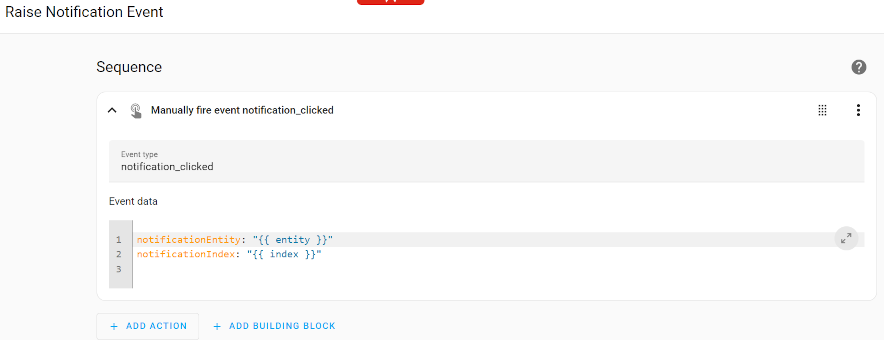

# Home Assistant Dashboard Notifications Setup

This guide walks you through setting up dynamic, actionable notifications in Home Assistant dashboards using an `input_select` entity and the `CodeCasa.NetDaemon.Notifications.InputSelect` library.

The end result will look like this:


## 📖 Table of Contents  
- [Prerequisits](#prerequisits)
- [Step 1: Configure appsettings.json](#step-1-configure-appsettingsjson)
- [Step 2: Create the NetDaemon app](#step-2-create-the-netdaemon-app)
- [Step 3: Configure the Home Assistant dashboard](#step-3-configure-the-home-assistant-dashboard)
    - [Step 3.1: Create an event script](#step-31-create-an-event-script)
    - [Step 3.2: Example dashboard config](#step-32-example-dashboard-config)

## Prerequisits

- You have a running NetDaemon app configured as described in the [CodeCasa.NetDaemon.Notifications.InputSelect chapter of the README](https://github.com/DevJasperNL/NetDaemon.Utils/tree/doc/input_select_hass_demo?tab=readme-ov-file#codecasanetdaemonnotificationsinputselect).
- Make sure that both an `input_select` and an `input_number` entity is configured.

## Step 1: Configure appsettings.json

For this example, the config below defines a single notification list linked to `input_select.jasper_notifications` and keeps a count in `input_number.jasper_notification_count`:

```json
"InputSelectNotificationEntities": [
  {
    "InputSelectEntityId": "input_select.jasper_notifications",
    "InputNumberEntityId": "input_number.jasper_notification_count"
  }
]
```

## Step 2: Create the NetDaemon app

Below is a demo NetDaemon app that:
- Adds notifications with click actions.
- Lets you remove notifications.
- Lets you undo removal.
- Lets you add new notifications manually.
- Lets you clear all demo notifications.

> 🧩 This code demonstrates the capabilities of the library; you can adapt it to your real automations.

```cs
[NetDaemonApp]
internal class DemoNotifications
{
    private List<InputSelectNotification> _notifications = [];
    private int _manuallyAddedIndex;

    public DemoNotifications(
        IHaContext haContext,
        JasperDashboardNotificationContext jasperNotifications)
    {
        _notifications.Clear();
        _manuallyAddedIndex = 0;

        var clickToRemoveNotificationId = $"{nameof(DemoNotifications)}_ClickToRemove";
        var clickToUndoRemoveNotificationId = $"{nameof(DemoNotifications)}_ClickToUndoRemove";

        void AddClickToRemoveNotificationAction() =>
            _notifications.Add(jasperNotifications.Notify(new InputSelectDashboardNotificationConfig
            {
                Order = 900,
                Message = "Demo Notification 1",
                SecondaryMessage = "Click to remove me.",
                Icon = "mdi:creation",
                IconColor = Color.Yellow,
                BadgeIcon = "mdi:delete",
                BadgeIconColor = Color.Red,
                Action = () =>
                {
                    jasperNotifications.RemoveNotification(clickToRemoveNotificationId);
                    _notifications = _notifications.Where(n => n.Id != clickToRemoveNotificationId).ToList();

                    _notifications.Add(jasperNotifications.Notify(new InputSelectDashboardNotificationConfig
                    {
                        Message = "Notification removed!",
                        SecondaryMessage = "Click to undo remove.",
                        Icon = "mdi:undo",
                        IconColor = Color.Green,
                        Timeout = TimeSpan.FromSeconds(3),
                        Action = () =>
                        {
                            jasperNotifications.RemoveNotification(clickToUndoRemoveNotificationId);
                            _notifications = _notifications.Where(n => n.Id != clickToUndoRemoveNotificationId).ToList();

                            AddClickToRemoveNotificationAction();
                        }
                    }, clickToUndoRemoveNotificationId));
                }
            }, clickToRemoveNotificationId));
        AddClickToRemoveNotificationAction();

        var addNotificationNotificationId = $"{nameof(DemoNotifications)}_Add";
        void AddNotificationNotificationAction() => _notifications.Add(jasperNotifications.Notify(new InputSelectDashboardNotificationConfig
        {
            Order = 901,
            Message = "Demo Notification 3",
            SecondaryMessage = "Click to add notification.",
            Icon = "mdi:creation",
            IconColor = Color.Yellow,
            BadgeIcon = "mdi:plus",
            BadgeIconColor = Color.Green,
            Action = () =>
            {
                _manuallyAddedIndex++;
                var notificationId = Guid.NewGuid().ToString();
                _notifications.Add(jasperNotifications.Notify(new InputSelectDashboardNotificationConfig
                {
                    Order = 902,
                    Message = $"Added Demo Notification ({_manuallyAddedIndex})",
                    SecondaryMessage = "Click to remove me.",
                    Icon = "mdi:creation",
                    IconColor = Color.Orange,
                    Action = () =>
                    {
                        jasperNotifications.RemoveNotification(notificationId);
                        _notifications = _notifications.Where(n => n.Id != notificationId).ToList();
                    }
                }, notificationId));
                AddNotificationNotificationAction();
            }
        }, addNotificationNotificationId));
        AddNotificationNotificationAction();

        var clearNotificationId = $"{nameof(DemoNotifications)}_Clear";
        _notifications.Add(jasperNotifications.Notify(new InputSelectDashboardNotificationConfig
        {
            Order = 903,
            Message = "Demo Notification 2",
            SecondaryMessage = "Click to clear demo notifications.",
            Icon = "mdi:creation",
            IconColor = Color.Yellow,
            BadgeIcon = "mdi:delete-circle",
            BadgeIconColor = Color.Red,
            Action = () =>
            {
                foreach (var notification in _notifications)
                {
                    jasperNotifications.RemoveNotification(notification);
                }

                _notifications.Clear();
            }
        }, clearNotificationId));
    }
}
```

## Step 3: Configure the Home Assistant dashboard

The goal:
- Show notifications dynamically in a vertical stack.
- Use a conditional card to show each notification only if it exists.
- Render each notification as a card (e.g., a mushroom-template-card).
- Trigger events when a notification is clicked, so `CodeCasa.NetDaemon.Notifications.InputSelect` handles the action.

🧩 Explanation:
- The notifications are stored as JSON in the input_select options list.
- The dashboard parses the JSON to show message, icon, etc.
- Clicking triggers a Home Assistant script that fires an event `CodeCasa.NetDaemon.Notifications.InputSelect` listens to.

### Step 3.1: Create an event script

In Home Assistant, add a script like this:



Make sure:
- Event type is `notification_clicked`.
- Event data:
```json
notificationEntity: "{{ entity }}"
notificationIndex: "{{ index }}"
```

### Step 3.2: Example dashboard config
Below is an example of a vertical stack that displays up to 10 notifications.
- Uses `input_number.jasper_notification_count` to know how many notifications there are.
- Uses `input_select.jasper_notifications` to get the notification data.

> ⚠️ You can adjust the number of slots or switch to auto-repeating logic.

```json
type: vertical-stack
cards:
  - type: conditional
    conditions:
      - condition: numeric_state
        entity: input_number.jasper_notification_count
        above: 0
    card:
      type: custom:mushroom-template-card
      primary: >-
        

        

        

        
          
          
            
            
              {{ jsonObj.m }}
              
            
          
        

        
          {{ "" }}
        
      secondary: >-
        

        

        

        
          
          
            
            
              {{ jsonObj.s }}
              
            
              {{ relative_time(strptime(jsonObj.t, '%Y-%m-%dT%H:%M:%S%z')) }} ago
              
            
          
        

        
          {{ "" }}
        
      icon: >-
        

        

        

        
          
          
            
            
              {{ jsonObj.i }}
              
            
          
        

        
          {{ "" }}
        
      icon_color: >-
        

        

        

        
          
          
            
            
              {{ jsonObj.c }}
              
            
          
        

        
          {{ "" }}
        
      badge_icon: >-
        

        

        

        
          
          
            
            
              {{ jsonObj.b }}
              
            
          
        

        
          {{ "" }}
        
      multiline_secondary: false
      badge_color: >-
        

        

        

        
          
          
            
            
              {{ jsonObj.o }}
              
            
          
        

        
          {{ "" }}
        
      tap_action:
        action: call-service
        service: script.turn_on
        data:
          variables:
            entity: input_select.jasper_notifications
            index: 0
        target:
          entity_id: script.raise_notification_event
  - type: conditional
    conditions:
      - condition: numeric_state
        entity: input_number.jasper_notification_count
        above: 1
    card:
      type: custom:mushroom-template-card
      primary: >-
        

        

        

        
          
          
            
            
              {{ jsonObj.m }}
              
            
          
        

        
          {{ "" }}
        
      secondary: >-
        

        

        

        
          
          
            
            
              {{ jsonObj.s }}
              
            
              {{ relative_time(strptime(jsonObj.t, '%Y-%m-%dT%H:%M:%S%z')) }} ago
              
            
          
        

        
          {{ "" }}
        
      icon: >-
        

        

        

        
          
          
            
            
              {{ jsonObj.i }}
              
            
          
        

        
          {{ "" }}
        
      icon_color: >-
        

        

        

        
          
          
            
            
              {{ jsonObj.c }}
              
            
          
        

        
          {{ "" }}
        
      badge_icon: >-
        

        

        

        
          
          
            
            
              {{ jsonObj.b }}
              
            
          
        

        
          {{ "" }}
        
      multiline_secondary: false
      badge_color: >-
        

        

        

        
          
          
            
            
              {{ jsonObj.o }}
              
            
          
        

        
          {{ "" }}
        
      tap_action:
        action: call-service
        service: script.turn_on
        data:
          variables:
            entity: input_select.jasper_notifications
            index: 1
        target:
          entity_id: script.raise_notification_event
  - type: conditional
    conditions:
      - condition: numeric_state
        entity: input_number.jasper_notification_count
        above: 2
    card:
      type: custom:mushroom-template-card
      primary: >-
        

        

        

        
          
          
            
            
              {{ jsonObj.m }}
              
            
          
        

        
          {{ "" }}
        
      secondary: >-
        

        

        

        
          
          
            
            
              {{ jsonObj.s }}
              
            
              {{ relative_time(strptime(jsonObj.t, '%Y-%m-%dT%H:%M:%S%z')) }} ago
              
            
          
        

        
          {{ "" }}
        
      icon: >-
        

        

        

        
          
          
            
            
              {{ jsonObj.i }}
              
            
          
        

        
          {{ "" }}
        
      icon_color: >-
        

        

        

        
          
          
            
            
              {{ jsonObj.c }}
              
            
          
        

        
          {{ "" }}
        
      badge_icon: >-
        

        

        

        
          
          
            
            
              {{ jsonObj.b }}
              
            
          
        

        
          {{ "" }}
        
      multiline_secondary: false
      badge_color: >-
        

        

        

        
          
          
            
            
              {{ jsonObj.o }}
              
            
          
        

        
          {{ "" }}
        
      tap_action:
        action: call-service
        service: script.turn_on
        data:
          variables:
            entity: input_select.jasper_notifications
            index: 2
        target:
          entity_id: script.raise_notification_event
  - type: conditional
    conditions:
      - condition: numeric_state
        entity: input_number.jasper_notification_count
        above: 3
    card:
      type: custom:mushroom-template-card
      primary: >-
        

        

        

        
          
          
            
            
              {{ jsonObj.m }}
              
            
          
        

        
          {{ "" }}
        
      secondary: >-
        

        

        

        
          
          
            
            
              {{ jsonObj.s }}
              
            
              {{ relative_time(strptime(jsonObj.t, '%Y-%m-%dT%H:%M:%S%z')) }} ago
              
            
          
        

        
          {{ "" }}
        
      icon: >-
        

        

        

        
          
          
            
            
              {{ jsonObj.i }}
              
            
          
        

        
          {{ "" }}
        
      icon_color: >-
        

        

        

        
          
          
            
            
              {{ jsonObj.c }}
              
            
          
        

        
          {{ "" }}
        
      badge_icon: >-
        

        

        

        
          
          
            
            
              {{ jsonObj.b }}
              
            
          
        

        
          {{ "" }}
        
      multiline_secondary: false
      badge_color: >-
        

        

        

        
          
          
            
            
              {{ jsonObj.o }}
              
            
          
        

        
          {{ "" }}
        
      tap_action:
        action: call-service
        service: script.turn_on
        data:
          variables:
            entity: input_select.jasper_notifications
            index: 3
        target:
          entity_id: script.raise_notification_event
  - type: conditional
    conditions:
      - condition: numeric_state
        entity: input_number.jasper_notification_count
        above: 4
    card:
      type: custom:mushroom-template-card
      primary: >-
        

        

        

        
          
          
            
            
              {{ jsonObj.m }}
              
            
          
        

        
          {{ "" }}
        
      secondary: >-
        

        

        

        
          
          
            
            
              {{ jsonObj.s }}
              
            
              {{ relative_time(strptime(jsonObj.t, '%Y-%m-%dT%H:%M:%S%z')) }} ago
              
            
          
        

        
          {{ "" }}
        
      icon: >-
        

        

        

        
          
          
            
            
              {{ jsonObj.i }}
              
            
          
        

        
          {{ "" }}
        
      icon_color: >-
        

        

        

        
          
          
            
            
              {{ jsonObj.c }}
              
            
          
        

        
          {{ "" }}
        
      badge_icon: >-
        

        

        

        
          
          
            
            
              {{ jsonObj.b }}
              
            
          
        

        
          {{ "" }}
        
      multiline_secondary: false
      badge_color: >-
        

        

        

        
          
          
            
            
              {{ jsonObj.o }}
              
            
          
        

        
          {{ "" }}
        
      tap_action:
        action: call-service
        service: script.turn_on
        data:
          variables:
            entity: input_select.jasper_notifications
            index: 4
        target:
          entity_id: script.raise_notification_event
  - type: conditional
    conditions:
      - condition: numeric_state
        entity: input_number.jasper_notification_count
        above: 5
    card:
      type: custom:mushroom-template-card
      primary: >-
        

        

        

        
          
          
            
            
              {{ jsonObj.m }}
              
            
          
        

        
          {{ "" }}
        
      secondary: >-
        

        

        

        
          
          
            
            
              {{ jsonObj.s }}
              
            
              {{ relative_time(strptime(jsonObj.t, '%Y-%m-%dT%H:%M:%S%z')) }} ago
              
            
          
        

        
          {{ "" }}
        
      icon: >-
        

        

        

        
          
          
            
            
              {{ jsonObj.i }}
              
            
          
        

        
          {{ "" }}
        
      icon_color: >-
        

        

        

        
          
          
            
            
              {{ jsonObj.c }}
              
            
          
        

        
          {{ "" }}
        
      badge_icon: >-
        

        

        

        
          
          
            
            
              {{ jsonObj.b }}
              
            
          
        

        
          {{ "" }}
        
      multiline_secondary: false
      badge_color: >-
        

        

        

        
          
          
            
            
              {{ jsonObj.o }}
              
            
          
        

        
          {{ "" }}
        
      tap_action:
        action: call-service
        service: script.turn_on
        data:
          variables:
            entity: input_select.jasper_notifications
            index: 5
        target:
          entity_id: script.raise_notification_event
  - type: conditional
    conditions:
      - condition: numeric_state
        entity: input_number.jasper_notification_count
        above: 6
    card:
      type: custom:mushroom-template-card
      primary: >-
        

        

        

        
          
          
            
            
              {{ jsonObj.m }}
              
            
          
        

        
          {{ "" }}
        
      secondary: >-
        

        

        

        
          
          
            
            
              {{ jsonObj.s }}
              
            
              {{ relative_time(strptime(jsonObj.t, '%Y-%m-%dT%H:%M:%S%z')) }} ago
              
            
          
        

        
          {{ "" }}
        
      icon: >-
        

        

        

        
          
          
            
            
              {{ jsonObj.i }}
              
            
          
        

        
          {{ "" }}
        
      icon_color: >-
        

        

        

        
          
          
            
            
              {{ jsonObj.c }}
              
            
          
        

        
          {{ "" }}
        
      badge_icon: >-
        

        

        

        
          
          
            
            
              {{ jsonObj.b }}
              
            
          
        

        
          {{ "" }}
        
      multiline_secondary: false
      badge_color: >-
        

        

        

        
          
          
            
            
              {{ jsonObj.o }}
              
            
          
        

        
          {{ "" }}
        
      tap_action:
        action: call-service
        service: script.turn_on
        data:
          variables:
            entity: input_select.jasper_notifications
            index: 6
        target:
          entity_id: script.raise_notification_event
  - type: conditional
    conditions:
      - condition: numeric_state
        entity: input_number.jasper_notification_count
        above: 7
    card:
      type: custom:mushroom-template-card
      primary: >-
        

        

        

        
          
          
            
            
              {{ jsonObj.m }}
              
            
          
        

        
          {{ "" }}
        
      secondary: >-
        

        

        

        
          
          
            
            
              {{ jsonObj.s }}
              
            
              {{ relative_time(strptime(jsonObj.t, '%Y-%m-%dT%H:%M:%S%z')) }} ago
              
            
          
        

        
          {{ "" }}
        
      icon: >-
        

        

        

        
          
          
            
            
              {{ jsonObj.i }}
              
            
          
        

        
          {{ "" }}
        
      icon_color: >-
        

        

        

        
          
          
            
            
              {{ jsonObj.c }}
              
            
          
        

        
          {{ "" }}
        
      badge_icon: >-
        

        

        

        
          
          
            
            
              {{ jsonObj.b }}
              
            
          
        

        
          {{ "" }}
        
      multiline_secondary: false
      badge_color: >-
        

        

        

        
          
          
            
            
              {{ jsonObj.o }}
              
            
          
        

        
          {{ "" }}
        
      tap_action:
        action: call-service
        service: script.turn_on
        data:
          variables:
            entity: input_select.jasper_notifications
            index: 7
        target:
          entity_id: script.raise_notification_event
  - type: conditional
    conditions:
      - condition: numeric_state
        entity: input_number.jasper_notification_count
        above: 8
    card:
      type: custom:mushroom-template-card
      primary: >-
        

        

        

        
          
          
            
            
              {{ jsonObj.m }}
              
            
          
        

        
          {{ "" }}
        
      secondary: >-
        

        

        

        
          
          
            
            
              {{ jsonObj.s }}
              
            
              {{ relative_time(strptime(jsonObj.t, '%Y-%m-%dT%H:%M:%S%z')) }} ago
              
            
          
        

        
          {{ "" }}
        
      icon: >-
        

        

        

        
          
          
            
            
              {{ jsonObj.i }}
              
            
          
        

        
          {{ "" }}
        
      icon_color: >-
        

        

        

        
          
          
            
            
              {{ jsonObj.c }}
              
            
          
        

        
          {{ "" }}
        
      badge_icon: >-
        

        

        

        
          
          
            
            
              {{ jsonObj.b }}
              
            
          
        

        
          {{ "" }}
        
      multiline_secondary: false
      badge_color: >-
        

        

        

        
          
          
            
            
              {{ jsonObj.o }}
              
            
          
        

        
          {{ "" }}
        
      tap_action:
        action: call-service
        service: script.turn_on
        data:
          variables:
            entity: input_select.jasper_notifications
            index: 8
        target:
          entity_id: script.raise_notification_event
  - type: conditional
    conditions:
      - condition: numeric_state
        entity: input_number.jasper_notification_count
        above: 9
    card:
      type: custom:mushroom-template-card
      primary: >-
        

        

        

        
          
          
            
            
              {{ jsonObj.m }}
              
            
          
        

        
          {{ "" }}
        
      secondary: >-
        

        

        

        
          
          
            
            
              {{ jsonObj.s }}
              
            
              {{ relative_time(strptime(jsonObj.t, '%Y-%m-%dT%H:%M:%S%z')) }} ago
              
            
          
        

        
          {{ "" }}
        
      icon: >-
        

        

        

        
          
          
            
            
              {{ jsonObj.i }}
              
            
          
        

        
          {{ "" }}
        
      icon_color: >-
        

        

        

        
          
          
            
            
              {{ jsonObj.c }}
              
            
          
        

        
          {{ "" }}
        
      badge_icon: >-
        

        

        

        
          
          
            
            
              {{ jsonObj.b }}
              
            
          
        

        
          {{ "" }}
        
      multiline_secondary: false
      badge_color: >-
        

        

        

        
          
          
            
            
              {{ jsonObj.o }}
              
            
          
        

        
          {{ "" }}
        
      tap_action:
        action: call-service
        service: script.turn_on
        data:
          variables:
            entity: input_select.jasper_notifications
            index: 9
        target:
          entity_id: script.raise_notification_event

```